# Architecture

The solution is using Azure automation account PaaS solution as an automation platform to execute the SAP shutdown/startup jobs.
Runbooks are written in PowerShell. There is also a PowerShell module SAPAzurePowerShellModules that is used by all runbooks. These runbooks and module are stored in PowerShell Gallery, and are easy to import. 

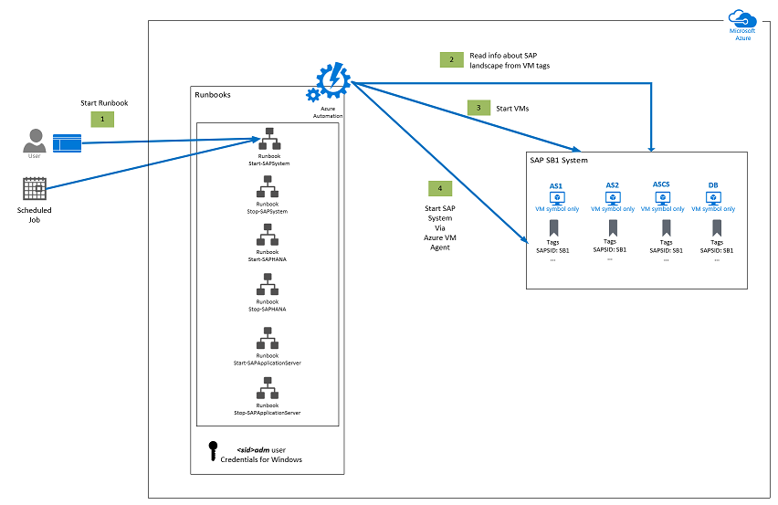

Information about SAP landscape and instances are store in VM Tags.

<sid>adm password needed on Windows OS is stored securely in **Credentials** area of Azure automation account. 

Secure assets in Azure Automation include credentials, certificates, connections, and encrypted variables. These assets are encrypted and stored in Azure Automation using a unique key that is generated for each Automation account. [Azure Automation stores the key in the system-managed Key Vault](https://docs.microsoft.com/en-us/azure/automation/shared-resources/credentials?tabs=azure-powershell). Before storing a secure asset, Automation loads the key from Key Vault and then uses it to encrypt the asset.

SAP system start / stop / monitoring and SAP Application server Start / stop is implemented using scripts (calling SAP sapcontrol executable) via the Azure VM agent. 

SAP HANA start / stop / monitoring is implemented using scripts (calling SAP sapcontrol executable) via the Azure VM agent. 

SQL Server start / stop / monitoring is implemented using scripts (calling SAP Host Agent executable) via the Azure VM agent. 

Every Azure runbook can be executed either manually or it can be scheduled. 

# Implementation

**Create Azure Automation Account**

First, [create an Azure Automation account](https://docs.microsoft.com/en-us/azure/automation/automation-quickstart-create-account).

**Import Az.Modules**

SAP start / stop PowerShell (PS) runbooks use new Az PS module, which must be [imported](https://docs.microsoft.com/en-us/azure/automation/az-modules#import-the-az-modules) .

Import Az modules:

  - **Az.Account**

  - **Az.Compute**

  - **Az.Automation**

  - **Az.Resources**

**Import SAP PowerShell Module**

Import **SAPAzurePowerShellModules** PowerShell module that will be used by SAP Runbooks.

> [!NOTE]
> PowerShell module **SAPAzurePowerShellModules** is stored in PowerShell Gallery and is easy to import into Azure automation account.

**Import SAP Runbooks**

Navigate to **Runbook** and click **Import a runbook**.

Import these runbooks:

  - Stop-SAPSystem

  - Start-SAPSystem

  - List-SAPSystemInstances

  - Stop-SAPHANA

  - Start-SAPHANA

  - List-SAPHANAInstance

  - Start-SAPApplicationServer

  - Stop-SAPApplicationServer

  - Tag-SAPCentralSystemHANA

  - Tag-SAPCentralSystemSQLServer

  - Tag-SAPSystemASCSInstanceLinux

  - Tag-SAPSystemASCSInstanceWindows

  - Tag-SAPSystemDialogInstanceLinux

  - Tag-SAPSystemDialogInstanceWindows

  - Tag-SAPSystemDVEBMGSInstanceLinux

  - Tag-SAPSystemDVEBMGSInstanceWindows

  - Tag-SAPSystemSCSInstanceLinux

  - Tag-SAPSystemSCSInstanceWindows

  - Tag-SAPSystemJavaApplicationServerInstanceLinux

  - Tag-SAPSystemJavaApplicationServerInstanceWindows

  - Tag-SAPSystemStandaloneHANA

  - Tag-SAPStandaloneSQLServer

  -
> [!NOTE] 
> All SAP runbooks are stored in PowerShell Gallery and are easy to import into Azure automation account.

Go to **Runbooks** **Gallery**

For **Source** choose: **PowerShell Gallery**

In the search field type: **Start-SAPSystem** and press Enter.

Click on **Start-SAPSystem** Runbook and click on **Import**.

Click **OK**.

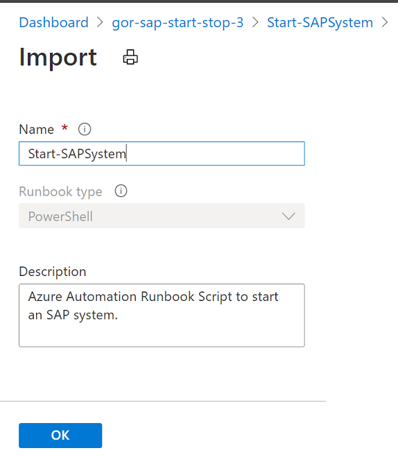

Import succeeded:

Go to **Runbooks** and click on **Start-SAPSystem** runbook.

Click on **Edit**.

Click **Publish** **and confirm** .

And confirm it.

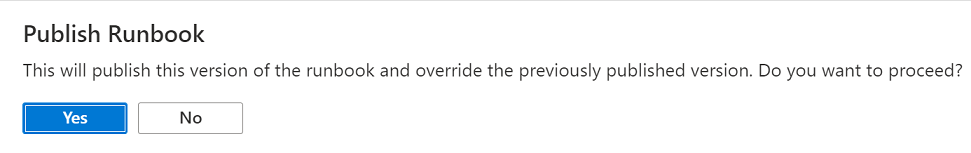

Now **Start-SAPSystem** runbook is now published and ready to be used.

Import in the same way for all other runbooks.

All runbooks are imported.

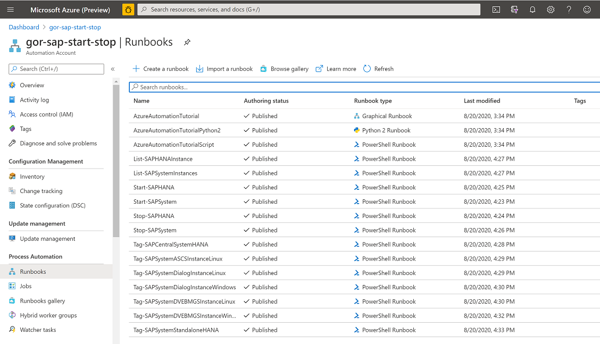

# Tagging Approach

In your SAP  landscape you have:

* ONE (HA for SAP central services is currently not implemented)
  * SAP ABAP ASCS instance
  * Or SAP ABAP DVEBMGS instances
  * or SAP Java SCS instances

*	ONE DBMS instance (HA for DBMS is currently not implemented)

* One or more SAP application servers 

, which are distributed on one or more Azure VMs.

General approach to tag VMs is following:

* Always tag VM with:
  * SAP ABAP ASCS instance
  * Or SAP ABAP DVEBMGS instances
  * or SAP Java SCS instances

* Always tag VM with DBMS instance

* Tag SAP application sever VM (ABAP or Java) 

* If you have two or more SAP instances (like ASCS and SAP application server) on one VM
  * You tag only ONE SAP instance 
  * Priority has SAP ASCS / SCS / DVEBMS instance

* On SAP central system with 1 VM , you tag:
  * SAP ASCS/SCS/DVEBMS instance
  * DBMS instance

# Sample configurations

## Central SAP ABAP System

### Central SAP-ABAP System With HANA

Here is an example of Central SAP ABAP System with HANA DB.

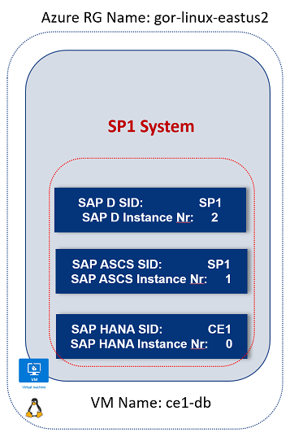

<table>
<thead>
<tr class="header">
<th><strong>Properties</strong></th>
<th><strong>Value</strong></th>
</tr>
</thead>
<tbody>
<tr class="odd">
<td>Azure Resource Group Name</td>
<td>gor-linux-eastus2</td>
</tr>
<tr class="even">
<td>VM Name</td>
<td>ce1-db</td>
</tr>
<tr class="odd">
<td>SAP System SID</td>
<td>SP1</td>
</tr>
<tr class="even">
<td>
SAP HANA SID *

* in central SAP system HANA SID is always different than SAP System SID
</td>
<td>CE1</td>
</tr>
<tr class="odd">
<td>SAP ASCS Instance Nr. 
[variation is to have an old DVEBMGS]</td>
<td>1</td>
</tr>
<tr class="even">
<td>SAP HANA Instance Nr</td>
<td>0</td>
</tr>
</tbody>
</table>

VM \[ce1-db\] has to be tagged with following Tags:

| Tag                          | Value     |
| ---------------------------- | --------- |
| SAPSystemSID                 | SP1       |
| SAPHANASID                   | CE1       |
| SAPDBMSType                  | HANA      |
| SAPHANAInstanceNumber        | 0         |
| SAPApplicationInstanceType   | SAP\_ASCS |
| SAPApplicationInstanceNumber | 1         |

You can create these Tags manually. However, to simplify and automate
Tagging process run this Azure runbook: **Tag-SAPCentralSystemHANA**

| Parameter                    | Mandatory | Comment                                                        |
| ---------------------------- | --------- | -------------------------------------------------------------- |
| ResourceGroupName            | YES       |                                                                |
| VMName                       | YES       |                                                                |
| SAPSID                       | YES       | SAP System SID                                                 |
| SAPApplicationInstanceNumber | YES       | Any SAP instance number – ASCS / SCS or SAP application server |
| SAPHANASID                   | YES       | SAP HANA SID – on central system it is DIFFERENT than SAPSID   |
| SAPHANAINstanceNumber        | YES       | SAP Instance umber                                             |

**INFO:** If you have two or more SAP application instance on one host
you will **tag only** **ONE** of them.  
Priority has SAP ASCS instance or DVEBMGS instance. 

### Central SAP ABAP System With SQL Server

Here is an example of Central SAP ABAP System with SQL Server.

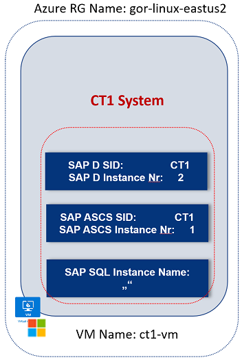

<table>
<thead>
<tr class="header">
<th><strong>Properties</strong></th>
<th><strong>Value</strong></th>
</tr>
</thead>
<tbody>
<tr class="odd">
<td>Azure Resource Group Name</td>
<td>gor-linux-eastus2</td>
</tr>
<tr class="even">
<td>VM Name</td>
<td>ct1-vm</td>
</tr>
<tr class="odd">
<td>SAP System SID</td>
<td>CT1</td>
</tr>
<tr class="even">
<td>SAP ASCS Instance Nr. 
[variation is to have an old DVEBMGS]</td>
<td>1</td>
</tr>
</tbody>
</table>

VM \[ct1-vm\] has to be tagged with following Tags:

| Tag                          | Value            |
| ---------------------------- | ---------------- |
| SAPSystemSID                 | CT1              |
| SAPApplicationInstanceType   | SAP\_ASCS        |
| SAPApplicationInstanceNumber | 1                |
| PathToSAPControl             | PathToSAPControl |
| SAPDBMSType                  | SQLServer        |
| DBInstanceName               |                  |

**  
  
  
INFO:** SQL Server could be installed either as:

  - **Default** **instance** – in this case DBInstanceName value is an
    empty string.  
    SQL Server would be addressed as **hostname**.

  - **Named instances** - in this case DBInstanceName has some value.  
    SQL Server would be addressed as **hostname\\\<DBInstanceName\>**.

You can create these Tags manually. However, to simplify and automate
Tagging process run this Azure runbook:
**Tag-SAPCentralSystemSQLServer**

| Parameter                          | Mandatory | Comment                                                            |
| ---------------------------------- | --------- | ------------------------------------------------------------------ |
| ResourceGroupName                  | YES       |                                                                    |
| VMName                             | YES       |                                                                    |
| SAPSID                             | YES       | SAP System SID                                                     |
| SAPASCSInstanceNumber              | YES       | Any SAP instance number – ASCS / SCS or SAP application server     |
| PathToSAPControl                   | YES       |                                                                    |
| SAPsidadmUserPassword              | YES       |                                                                    |
| DBInstanceName                     | No        | Default value is an empty string (for default SQL Server Instance) |
| AutomationAccountResourceGroupName | YES       |                                                                    |
| AutomationAccountName              | YES       |                                                                    |

**INFO:** If you have two or more SAP application instance on one host
you will **tag only ONE** of them.  
Priority has SAP ASCS instance or DVEBMGS instance.

### Central SAP ABAP System With Oracle, IBM DB2, Sybase, Max DB

In the case of DBMS like: Oracle, IBM DB2 , Sybase or MaxDB, tag the VM:

  - On windows with runbook **Tag-SAPSystemASCSInstanceWindows**

  - On Linux **Tag-SAPSystemASCSInstanceLinux**

  - Add the tag for :
    
      - **Oracle**  
        SAPDBMSType = Oracle
    
      - **IBM DB2**  
        SAPDBMSType = IBMDB2
    
      - **MaxDB**  
        SAPDBMSType = MaxDB
    
      - **Sybase**  
        SAPDBMSType = Sybase

## Distributed SAP ABAP System with HANA – ALL Linux

Here is an example of a distributed SAP ABAP System **TS1** with HANA
DB. ALL VMs are Linux VMs. SAP HANA SID **TS2** is different than SAP
SID **TS1**.

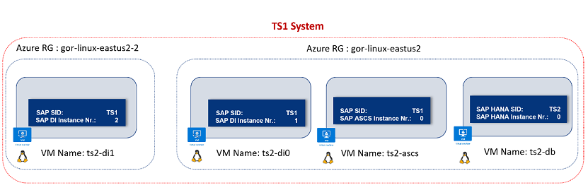

### HANA DB VM

DB has following properties.

<table>
<thead>
<tr class="header">
<th><strong>Properties</strong></th>
<th><strong>Value</strong></th>
</tr>
</thead>
<tbody>
<tr class="odd">
<td>VM Name</td>
<td>ts2-db</td>
</tr>
<tr class="even">
<td>Azure Resource Group Name</td>
<td>gor-linux-eastus2</td>
</tr>
<tr class="odd">
<td>SAP System SID</td>
<td>TS1</td>
</tr>
<tr class="even">
<td>
SAP HANA SID *

* in central SAP system HANA SID is can be different than SAP System SID
</td>
<td>TS2</td>
</tr>
<tr class="odd">
<td>SAP HANA Instance Nr</td>
<td>0</td>
</tr>
</tbody>
</table>

VM \[ts2-db\] has to be tagged with following Tags:

| Tag                   | Value |
| --------------------- | ----- |
| SAPSystemSID          | TS1   |
| SAPHANASID            | TS2   |
| SAPDBMSType           | HANA  |
| SAPHANAINstanceNumber | 0     |

You can create these Tags manually. However, to simplify and automate
Tagging process run this Azure runbook: **Tag-SAPSystemStandaloneHANA**

| Parameter             | Mandatory | Value             |
| --------------------- | --------- | ----------------- |
| ResourceGroupName     | YES       | gor-linux-eastus2 |
| VMName                | YES       | ts2-db            |
| SAPSID                | YES       | TS1               |
| SAPHANASID            | YES       | TS2               |
| SAPHANAINstanceNumber | YES       | 0                 |

### ASCS VM

ASCS has following properties.

| **Properties**            | **Value**         |
| ------------------------- | ----------------- |
| Azure Resource Group Name | gor-linux-eastus2 |
| VM Name                   | ts2-ascs          |
| SAP System SID            | TS1               |
| SAP ASCS Instance Nr      | 0                 |

VM \[ts2-ascs\] has to be tagged with following Tags:

| Tag                          | Value     |
| ---------------------------- | --------- |
| SAPSystemSID                 | TS1       |
| SAPApplicationInstanceType   | SAP\_ASCS |
| SAPApplicationInstanceNumber | 1         |

You can create these Tags manually. However, to simplify and automate
Tagging process run this Azure runbook:
**Tag-SAPSystemASCSInstanceLinux**

| Parameter             | Mandatory | Value             |
| --------------------- | --------- | ----------------- |
| ResourceGroupName     | YES       | gor-linux-eastus2 |
| VMName                | YES       | ts2-ascs          |
| SAPSID                | YES       | TS1               |
| SAPASCSInstanceNumber | YES       | 1                 |

### SAP Application Server 1 VM

SAP application server 1 has following properties.

| **Properties**            | **Value**         |
| ------------------------- | ----------------- |
| Azure Resource Group Name | gor-linux-eastus2 |
| VM Name                   | ts2-di0           |
| SAP System SID            | TS1               |
| SAP Dialog Instance Nr    | 1                 |

VM \[ts2-di0\] has to be tagged with following Tags:

| Tag                          | Value  |
| ---------------------------- | ------ |
| SAPSystemSID                 | TS1    |
| SAPApplicationInstanceType   | SAP\_D |
| SAPApplicationInstanceNumber | 1      |

You can create these Tags manually. However, to simplify and automate
Tagging process run this Azure runbook: Tag-SAPSystemDialogInstanceLinux

| Parameter               | Mandatory | Value             |
| ----------------------- | --------- | ----------------- |
| ResourceGroupName       | YES       | gor-linux-eastus2 |
| VMName                  | YES       | ts2-ascs          |
| SAPSID                  | YES       | TS1               |
| SAPDialogInstanceNumber | YES       | 1                 |

### SAP Application Server 2 VM

SAP application server 2 has following properties.

| **Properties**            | **Value**           |
| ------------------------- | ------------------- |
| Azure Resource Group Name | gor-linux-eastus2-2 |
| VM Name                   | ts2-di1             |
| SAP System SID            | TS1                 |
| SAP Dialog Instance Nr    | 2                   |

VM \[ts2-di0\] has to be tagged with following Tags:

| Tag                          | Value  |
| ---------------------------- | ------ |
| SAPSystemSID                 | TS1    |
| SAPApplicationInstanceType   | SAP\_D |
| SAPApplicationInstanceNumber | 2      |

You can create these Tags manually. However, to simplify and automate
Tagging process run this Azure runbook: Tag-SAPSystemDialogInstanceLinux

| Parameter               | Mandatory | Value               |
| ----------------------- | --------- | ------------------- |
| ResourceGroupName       | YES       | gor-linux-eastus2-2 |
| VMName                  | YES       | ts2-di1             |
| SAPSID                  | YES       | TS1                 |
| SAPDialogInstanceNumber | YES       | 2                   |

## Distributed SAP ABAP System with HANA – Application Layer Windows

Here is an example of a distributed SAP ABAP System **PR2** with HANA
DB.  
Application layer (SAP ASCS and Dialog instances) VMs are Windows VMs.  
SAP HANA SID **PR2** is same as SAP SID **PR1**.

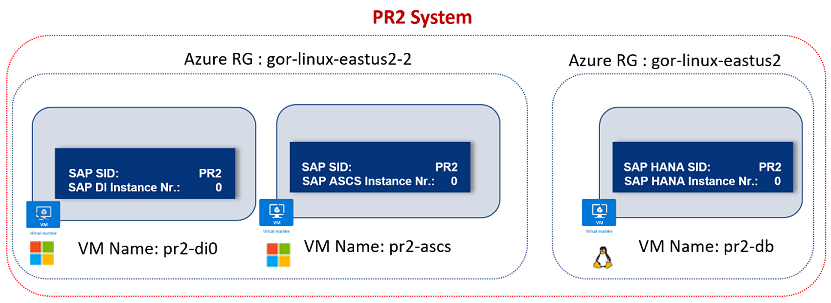

### HANA DB VM

DB has following properties.

<table>
<thead>
<tr class="header">
<th><strong>Properties</strong></th>
<th><strong>Value</strong></th>
</tr>
</thead>
<tbody>
<tr class="odd">
<td>VM Name</td>
<td>pr2-db</td>
</tr>
<tr class="even">
<td>Azure Resource Group Name</td>
<td>gor-linux-eastus2</td>
</tr>
<tr class="odd">
<td>SAP System SID</td>
<td>PR2</td>
</tr>
<tr class="even">
<td>
SAP HANA SID *

* in central SAP system HANA SID is can be different than SAP System SID
</td>
<td>PR2</td>
</tr>
<tr class="odd">
<td>SAP HANA Instance Nr</td>
<td>0</td>
</tr>
</tbody>
</table>

VM \[ts2-db\] has to be tagged with following Tags:

| Tag                   | Value |
| --------------------- | ----- |
| SAPSystemSID          | PR2   |
| SAPHANASID            | PR2   |
| SAPDBMSType           | HANA  |
| SAPHANAINstanceNumber | 0     |

You can create these Tags manually. However, to simplify and automate
Tagging process run this Azure runbook: **Tag-SAPSystemStandaloneHANA**

| Parameter             | Mandatory | Value             |
| --------------------- | --------- | ----------------- |
| ResourceGroupName     | YES       | gor-linux-eastus2 |
| VMName                | YES       | pr2-db            |
| SAPSID                | YES       | PR2               |
| SAPHANASID            | YES       | PR2               |
| SAPHANAINstanceNumber | YES       | 0                 |

### ASCS VM \[Windows\]

ASCS has following properties.

| **Properties**            | **Value**           |
| ------------------------- | ------------------- |
| Azure Resource Group Name | gor-linux-eastus2-2 |
| VM Name                   | pr2-ascs            |
| SAP System SID            | PR2                 |
| SAP ASCS Instance Nr      | 0                   |

VM \[ts2-ascs\] has to be tagged with following Tags:

| Tag                          | Value                                          |
| ---------------------------- | ---------------------------------------------- |
| SAPSystemSID                 | PR2                                            |
| SAPApplicationInstanceType   | SAP\_ASCS                                      |
| SAPApplicationInstanceNumber | 0                                              |
| PathToSAPControl             | C:\\usr\\sap\\PR2\\ASCS00\\exe\\sapcontrol.exe |

Create in \<sid\>adm password in **Credential** area of Azure automation
account.

Click **Add credentials**, ***Name*** = prdadm, ***User name*** = pr2adm
, ***Password*** = \<password\>

You can create these Tags manually. However, to simplify and automate
Tagging process run this Azure runbook:
**Tag-SAPSystemASCSInstanceWindows  
**Tags runbook will store \<sid\>adm password in secure area as well.

| Parameter                          | Mandatory | Value                                          |
| ---------------------------------- | --------- | ---------------------------------------------- |
| ResourceGroupName                  | YES       | gor-linux-eastus2-2                            |
| VMName                             | YES       | pr2-ascs                                       |
| SAPSID                             | YES       | PR2                                            |
| SAPASCSInstanceNumber              | YES       | 0                                              |
| PathToSAPControl                   | YES       | C:\\usr\\sap\\PR2\\ASCS00\\exe\\sapcontrol.exe |
| SAPsidadmUserPassword              | YES       | Mypr2admpassword                               |
| AutomationAccountResourceGroupName | YES       | gor-startstop-rg                               |
| AutomationAccountName              | YES       | gor-sap-start-stop                             |

### SAP Application Server VM \[Windows\]

SAP application server has following properties.

| **Properties**            | **Value**           |
| ------------------------- | ------------------- |
| Azure Resource Group Name | gor-linux-eastus2-2 |
| VM Name                   | pr2-di0             |
| SAP System SID            | PR1                 |
| SAP Dialog Instance Nr    | 0                   |

VM \[pr2-di0\] has to be tagged with following Tags:

| Tag                          | Value                                       |
| ---------------------------- | ------------------------------------------- |
| SAPSystemSID                 | PR2                                         |
| SAPApplicationInstanceType   | SAP\_D                                      |
| SAPApplicationInstanceNumber | 0                                           |
| PathToSAPControl             | C:\\usr\\sap\\PR2\\D00\\exe\\sapcontrol.exe |

Create in \<sid\>adm password in **Credential** area of Azure automation
account.

Click **Add credentials**, ***Name*** = prdadm, ***User name*** = pr2adm
, ***Password*** = \<password\>

You can create these Tags manually. However, to simplify and automate
Tagging process run this Azure runbook:
**Tag-SAPSystemDialogInstanceWindows  
**Tags runbook will store \<sid\>adm password in secure area as well.

| Parameter                          | Mandatory | Value                                       |
| ---------------------------------- | --------- | ------------------------------------------- |
| ResourceGroupName                  | YES       | gor-linux-eastus2-2                         |
| VMName                             | YES       | pr2-di0                                     |
| SAPSID                             | YES       | PR2                                         |
| SAPDialogInstanceNumber            | YES       | 0                                           |
| PathToSAPControl                   | YES       | C:\\usr\\sap\\PR2\\D00\\exe\\sapcontrol.exe |
| SAPsidadmUserPassword              | YES       | \<MyPR2ADMPassword\>                        |
| AutomationAccountResourceGroupName | YES       | gor-startstop-rg                            |
| AutomationAccountName              | YES       | gor-sap-start-stop                          |

## DVEBMGS Instance on Linux

If you would have an old so-called central instance e.g. DVEBMGS
instance on Linux, then VM has to be tagged with following Tags:

| **Tag**                      | **Value**    |
| ---------------------------- | ------------ |
| SAPSystemSID                 | TS1          |
| SAPApplicationInstanceType   | SAP\_DVEBMGS |
| SAPApplicationInstanceNumber | 0            |

You can create these Tags manually.

To simplify and automate Tagging process run this Azure runbook:
**Tag-** **SAPSystemDVEBMGSInstanceLinux**.

**  
**

## DVEBMGS Instance on Windows

If you would have an old so-called central instance e.g. DVEBMGS
instance on Windows, then VM must be tagged with following Tags:

| Tag                          | Value                                              |
| ---------------------------- | -------------------------------------------------- |
| SAPSystemSID                 | PR2                                                |
| SAPApplicationInstanceType   | SAP\_DVEBMGS                                       |
| SAPApplicationInstanceNumber | 0                                                  |
| PathToSAPControl             | C:\\usr\\sap\\PR2\\ DVEBMGS00\\exe\\sapcontrol.exe |

Create in \<sid\>adm password in **Credential** area of Azure automation
account.

Click **Add credentials**, ***Name*** = pr2adm, ***User name*** = pr2adm
, ***Password*** = \<password\>

You can create these Tags manually. However, to simplify and automate
Tagging process run this Azure runbook: **Tag-**
**SAPSystemDVEBMGSInstanceWindows**.

| Parameter                          | Mandatory | Value                                             |
| ---------------------------------- | --------- | ------------------------------------------------- |
| ResourceGroupName                  | YES       | gor-linux-eastus2-2                               |
| VMName                             | YES       | pr2-ascs                                          |
| SAPSID                             | YES       | PR2                                               |
| SAPDVEBMGSInstanceNumber           | YES       | 0                                                 |
| PathToSAPControl                   | YES       | C:\\usr\\sap\\PR2\\DVEBMGS00\\exe\\sapcontrol.exe |
| SAPsidadmUserPassword              | YES       | \<MyPR2ADMPassword\>                              |
| AutomationAccountResourceGroupName | YES       | gor-startstop-rg                                  |
| AutomationAccountName              | YES       | gor-sap-start-stop                                |

## Two or more SAP Instances on ONE VM

If you have two or more SAP application instances (ASCS, DVEBMS, Dialog)
on ONE VM:

  - Tag only ONE SAP instance

  - Tag always ASCS or DVEBMGS instance if existing

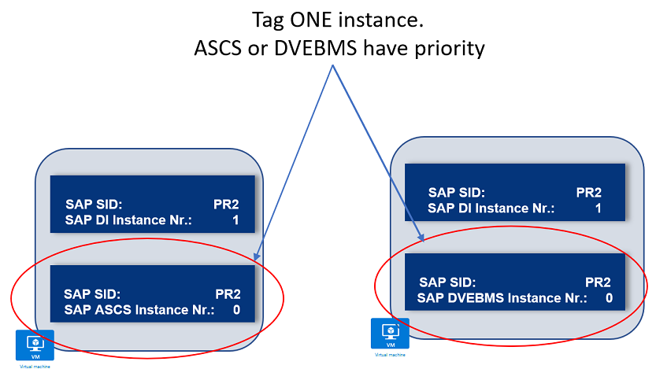

## Standalone SAP HANA 

You have just standalone SAP HANA DB on one VM, without an SAP system.

DB has following properties.

<table>
<thead>
<tr class="header">
<th><strong>Properties</strong></th>
<th><strong>Value</strong></th>
</tr>
</thead>
<tbody>
<tr class="odd">
<td>VM Name</td>
<td>pr2-db</td>
</tr>
<tr class="even">
<td>Azure Resource Group Name</td>
<td>gor-linux-eastus2</td>
</tr>
<tr class="odd">
<td>
SAP HANA SID *

* in central SAP system HANA SID is can be different than SAP System SID
</td>
<td>PR2</td>
</tr>
<tr class="even">
<td>SAP HANA Instance Nr</td>
<td>0</td>
</tr>
</tbody>
</table>

VM \[ts2-db\] must be tagged with following Tags:

| Tag                   | Value |
| --------------------- | ----- |
| SAPHANASID            | PR2   |
| SAPDBMSType           | HANA  |
| SAPHANAINstanceNumber | 0     |

You can create these Tags manually. However, to simplify and automate
Tagging process run this Azure runbook: **Tag-SAPStandaloneHANA**

| Parameter             | Mandatory | Value             |
| --------------------- | --------- | ----------------- |
| ResourceGroupName     | YES       | gor-linux-eastus2 |
| VMName                | YES       | pr2-db            |
| SAPSID                | YES       | PR2               |
| SAPHANASID            | YES       | PR2               |
| SAPHANAINstanceNumber | YES       | 0                 |

## Distributed SAP ABAP System with SQL Server

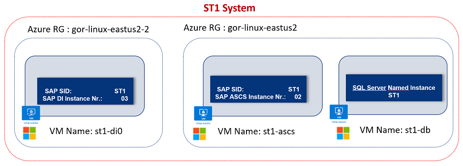 

### SQL Server DB VM 

### 

### DB has following properties.

| **Properties**            | **Value**         |
| ------------------------- | ----------------- |
| VM Name                   | st1-db            |
| Azure Resource Group Name | gor-linux-eastus2 |
| SAP System SID            | ST1               |
| SQL Server Instance       | ST1               |

VM \[st1-db\] has to be tagged with following Tags:

| Tag                                   | Value     |
| ------------------------------------- | --------- |
| SAPSystemSID                          | ST1       |
| SAPDBMSType                           | SQLServer |
| DBInstanceName (it is named instance) | ST1       |

You can create these Tags manually. However, to simplify and automate
Tagging process run this Azure runbook: **Tag-SAPStandaloneSQLServer**

| Parameter         | Mandatory | Value             |
| ----------------- | --------- | ----------------- |
| ResourceGroupName | YES       | gor-linux-eastus2 |
| VMName            | YES       | st1-db            |
| SAPSID            | YES       | ST1               |
| DBInstanceName    | YES       | ST1               |

### ASCS VM \[Windows\]  

Check above chapter how to tag ASCS VM on Windows .

### Application Server VM \[Windows\]

Check above chapter how to tag application server VM on Windows.

## Distributed SAP ABAP System with Other DBMS

For distributed systems with Oracle , IBM DB2, Sybase, MAxDB:

  - On DBMS VM create these tags
    
      - **Oracle**  
        SAPDBMSType = Oracle
    
      - **IBM DB2**  
        SAPDBMSType = IBMDB2
    
      - **MaxDB**  
        SAPDBMSType = MaxDB
    
      - **Sybase**  
        SAPDBMSType = Sybase

Tag ASCS instance VM using runbooks:

  - Tag-SAPSystemASCSInstanceLinux - on Linux

  - Tag-SAPSystemASCSInstanceWindows – on Windows

Tah SAP Application server VMs using runbooks:

  - Tag-SAPSystemDialogInstanceLinux - on Linux

<!-- end list -->

  - Tag-SAPSystemDialogInstanceWindows – on Windows

# Runbook Description

Listing SAP System \<SID\> VMs  
To check and list VMs associated to an SAP SID run Runbook:
**List-SAPSystemInstances**

| Parameter | Mandatory | Default value | Comment |
| --------- | --------- | ------------- | ------- |
| SAPSID    | YES       |               |         |

Listing SAP HANA VM  
To check and list VMs associated to an SAP SID run Runbook: **List-**
**SAPHANAInstance**

| Parameter | Mandatory | Default value | Comment |
| --------- | --------- | ------------- | ------- |
| SAPSID    | YES       |               |         |

Start SAP System

To start SAP System run Runbook: **Start-SAPSystem**

| Parameter                 | Mandatory | Default value | Comment                                                |
| ------------------------- | --------- | ------------- | ------------------------------------------------------ |
| SAPSID                    | YES       |               |                                                        |
| WaitForStartTimeInSeconds | No        | 600           | Wait time to start SAP system                          |
| ConvertDisksToPremium     | No        | $False        | If set to $True, all disk will be converted to Premium |
| PrintExecutionCommand     | No        | $False        | If set to $True, all OS commands will be printed       |

Runtime steps are:

  - Convert disk to Premium, if desired  
    ConvertDisksToPremium = $True

  - Start VMs in this order:
    
      - SAP ASCS or DVEBMS VM
    
      - SAP DBMS VM
    
      - SAP Dialog instances VMs

  - Show SAP DBMS Status

  - Start SAP DBMS

  - Show SAP DBMS Status

  - List SAP ABAP instances and show status.

<!-- end list -->

  - Start SAP ABAP system and wait for WaitForStartTimeInSeconds
    seconds.

  - List SAP ABAP instances and show status.

  - Show summary.

Stop SAP System

To stop SAP System run Runbook: **Stop-SAPSystem**

| Parameter                 | Mandatory | Default value | Comment                                                 |
| ------------------------- | --------- | ------------- | ------------------------------------------------------- |
| SAPSID                    | YES       |               |                                                         |
| SoftShutdownTimeInSeconds | No        | 600           | Soft Shutdown time for SAP system                       |
| ConvertDisksToStandard    | No        | $False        | If set to $True, all disk will be converted to standard |
| PrintExecutionCommand     | No        | $False        | If set to $True, all OS commands will be printed        |

Runtime steps:

  - List SAP ABAP instances and show status.

  - Stop SAP ABAP System with soft shutdown SoftShutdownTimeInSeconds

  - List SAP ABAP instances and show status.

  - Get SAP DBMS status

  - Stop SAP DBMS

  - Get DBMS status

  - Stop VMs in this order:
    
      - SAP Dialog instances VMs
    
      - SAP DBMS VM
    
      - SAP ASCS or DVEBMS VM

  - Convert disk to Standard, if desired  
    ConvertDisksToStandard = $True

<!-- end list -->

  - Show summary.

Start-SAPHANADB

This runbook will only start VM and standalone HANA DB.

| **Parameter**         | **Mandatory** | **Default value** |
| --------------------- | ------------- | ----------------- |
| SAPHANASID            | YES           |                   |
| ConvertDisksToPremium | No            | $False            |
| PrintExecutionCommand | No            | $False            |

Runtime steps are:

  - Convert disk to Premium, if desired  
    ConvertDisksToPremium = $True

  - Start VM.

  - Show SAP HANA Status

  - Start SAP HANA

  - Show SAP HANA Status

  - Show summary.

Stop-SAPHANADB

This runbook will stop standalone HANA DB, and VM.

| **Parameter**          | **Mandatory** | **Default value** |
| ---------------------- | ------------- | ----------------- |
| SAPHANASID             | YES           |                   |
| ConvertDisksToStandard | No            | $False            |
| PrintExecutionCommand  | No            | $False            |

Runtime steps:

  - Show SAP HANA Instance status

  - Stop SAP HANA

  - Show SAP HANA status

  - Stop VM.

  - Convert disk to Standard, if desired  
    ConvertDisksToStandard = $True

  - Show summary.

## 

Stop- SAPApplicationServer

This runbook will stop standalone SAP Application Server and VM.

| **Parameter**                | **Mandatory** | **Default value** |
| ---------------------------- | ------------- | ----------------- |
| ResourceGroupName            | YES           |                   |
| VMName                       | YES           |                   |
| SAPApplicationServerWaitTime | No            | 300               |
| ConvertDisksToStandard       | No            | $False            |
| PrintExecutionCommand        | No            | $False            |

Runtime steps:

  - Stop SAP application server.

  - Stop VM.

  - Convert disk to Standard, if desired  
    ConvertDisksToStandard = $True

  - Show summary.

Start- SAPApplicationServer

This runbook will start VM and standalone SAP Application Server.

| **Parameter**                | **Mandatory** | **Default value** |
| ---------------------------- | ------------- | ----------------- |
| ResourceGroupName            | YES           |                   |
| VMName                       | YES           |                   |
| SAPApplicationServerWaitTime | No            | 300               |
| ConvertDisksToPremium        | No            | $False            |
| PrintExecutionCommand        | No            | $False            |

Runtime steps:

  - Convert disk to Premium, if desired  
    ConvertDisksToPremium = $True

  - Start VM.

  - Start SAP application server.

  - Show summary.

# How to start a runbook

Go to **Runbooks**

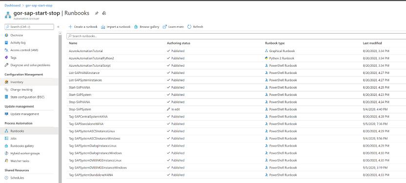

Click on one runbook, for example **Start-SAPSystem**

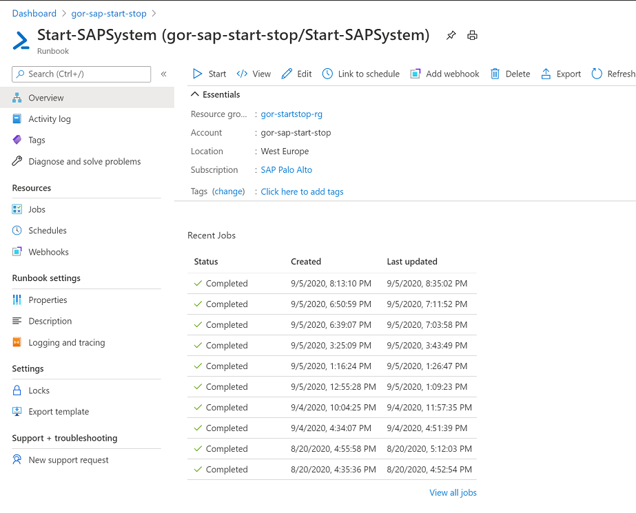

And click **Start** , fill the required parameters (**\***), and click
**OK**

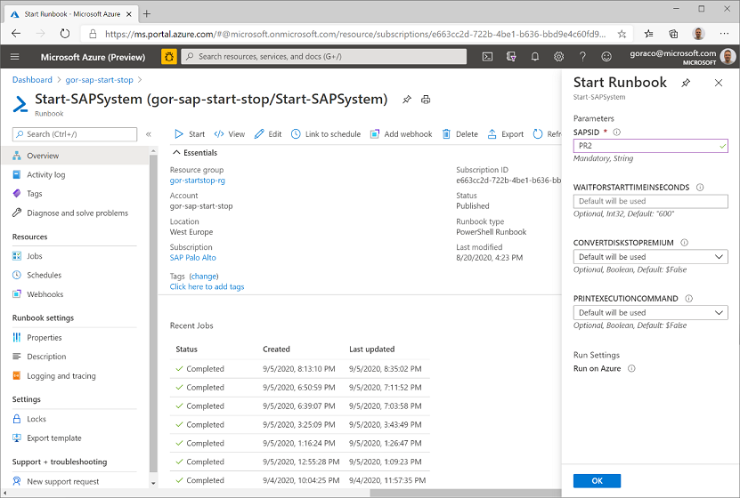

**INFO**: Parameters with **\*** are **mandatory\!**

Runbook is running.

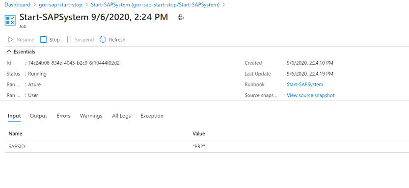

Check the logs in ***All logs*** or ***Output.***

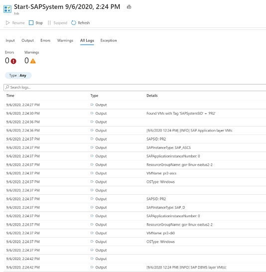

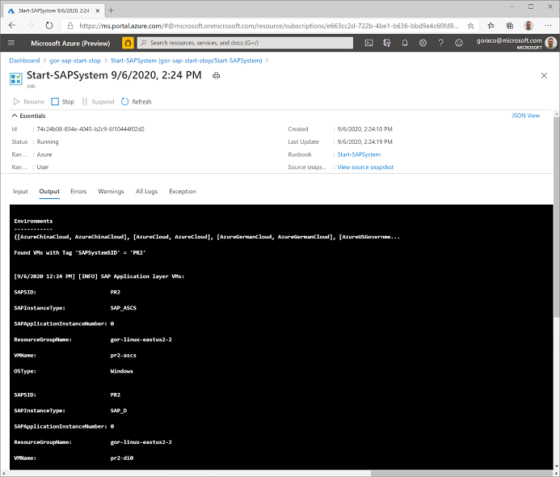

# Schedule Start/Stop DEV Systems

Creating schedules make sense for repeating tasks, for example.

  - Start SAP DEV / TEST systems Mon- Fri at 9 am

  - Stop SAP DEV / TEST systems Mon- Fri at 6 pm

### Create / Add Schedule  

Go to ***Schedules*** tab and click ***Add schedule***

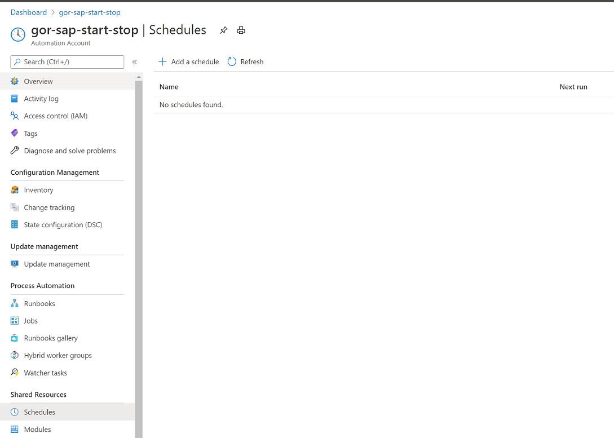

Configure parameters and click ***Create***  
In example below, it is configured Start Schedule at 9 am , from Monday
till Friday:

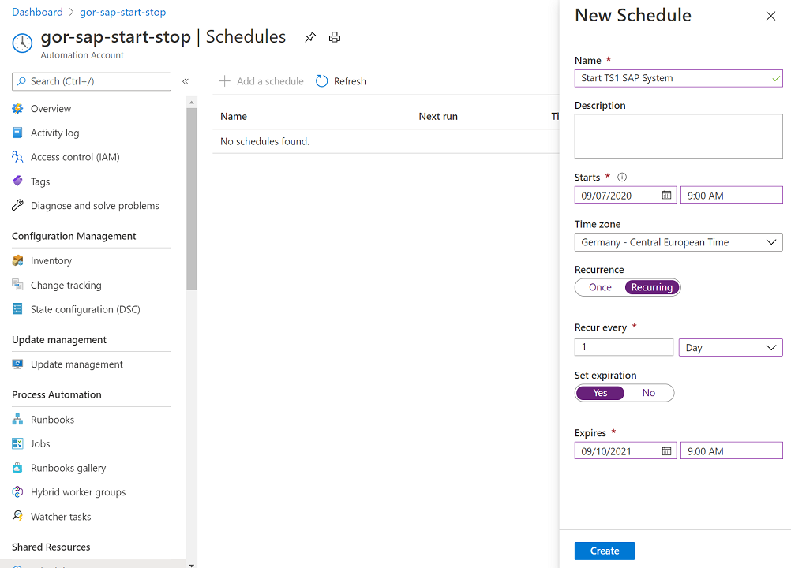

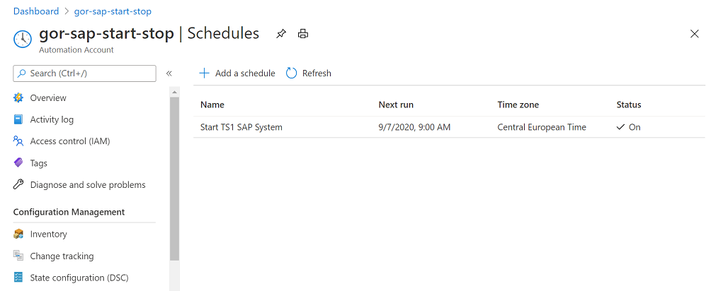

### Link Schedule to a runbook and specify input parameters.

Go to ***Runbooks*** and click on one runbook, choose Schedules tab,
click ***Add a schedule***.

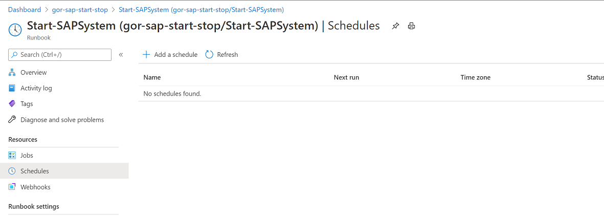

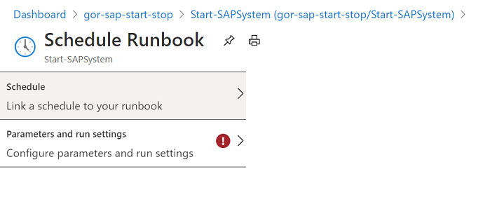

Click “**Link a schedule to your runbook**”, and choose previously
created schedule “**Start TS1 SAP System**”.

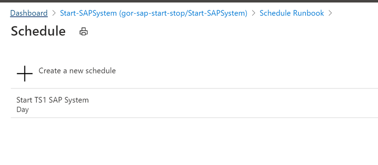

Click on “**Configure parameters and run settings**”

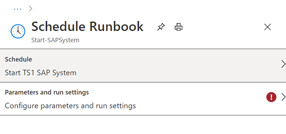

And fill the parameters and click **OK**.

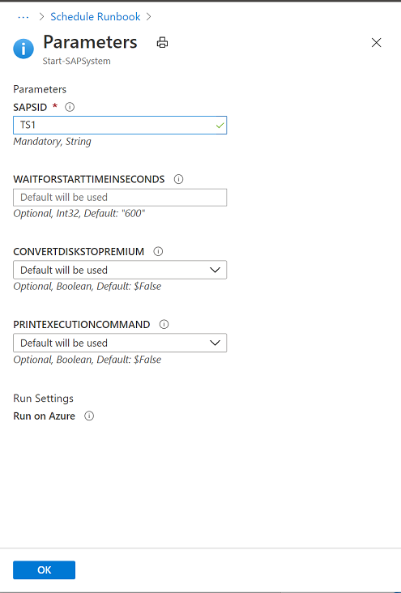

Here is the list of all schedules:

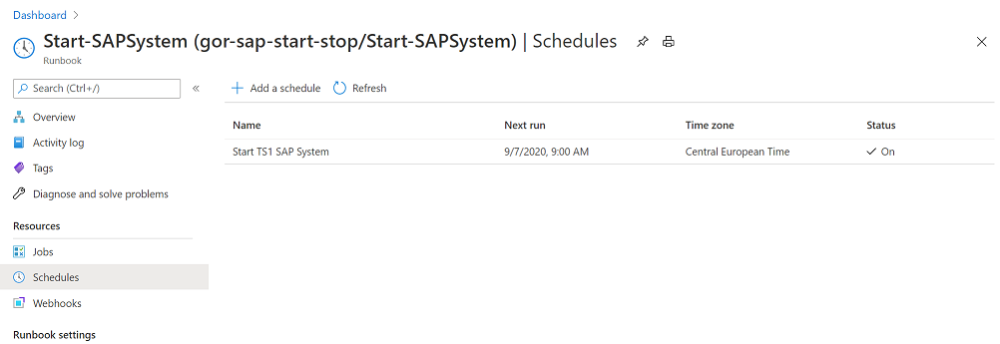

Repeat the same steps to create Stop schedule, e.g. using
**Stop-SAPSystem** runbook, with schedule for example to stop SAP system
TS1 at 6 pm.

# Schedule Scale Out / Scale In of SAP Application Servers

SAP runbooks:

  - Start-SAPApplicationServer

  - Stop-SAPApplicationServer

can be used to implement SAP application server scale out / scale in
scenario.

Assumption are:

  - SAP administer knows about their expected peaks, when the peak
    starts and when it ends , and they knows out of experience how much
    SAPS e.g. how many SAP application servers will be needed for this
    action.

  - SAP application servers are already installed.

  - Different SAP logon groups are already preconfigured.

A scenario example could be:

  - There is a black Friday peak, which last for 4 days – before peak
    starts, you would schedule start of certain number of SAP
    application servers. You would also schedule by the end of the peak
    to stop these SAP application servers and VMs.

  - Is know that during the working hours you need more SAPS that during
    the night

Stopping can be done with **Soft shutdown** approach, so application
severe will go gradually through the stop process, and users will have
time to log off, SAP batch jobs will have time to finish, until the
specified time out is reached.

# Access consideration for Azure Automation Runbooks and Jobs

Utilizing the SAP start/stop automation you can also limit the rights on
Azure resources such as VMs while at same time do a finer grained
segregation of access to individual Automation runbooks and jobs.

The deployed Azure Automation account inherits role assignments from the
resource group and/or subscription/management group. Utilizing the
principle of least privileges, you might or might not already have
rights to start/stop Automation runbooks and view runbook jobs outputs.

The following is a list of prebuild roles for Automation accounts, as
applicable in the context of this document. Full list of roles for
Automation can be seen here in documentation.

| **Role**                    | **Description**                                                                                                                                                                                                                                                                                                                                                               |
| --------------------------- | ----------------------------------------------------------------------------------------------------------------------------------------------------------------------------------------------------------------------------------------------------------------------------------------------------------------------------------------------------------------------------- |
| Owner                       | The Owner role allows access to all resources and actions within an Automation account including providing access to other users, groups, and applications to manage the Automation account.                                                                                                                                                                                  |
| Contributor                 | The Contributor role allows you to manage everything except modifying other user’s access permissions to an Automation account.                                                                                                                                                                                                                                               |
| Reader                      | The Reader role allows you to view all the resources in an Automation account but cannot make any changes.                                                                                                                                                                                                                                                                    |
| User Access Administrator   | The User Access Administrator role allows you to manage user access to Azure Automation accounts.                                                                                                                                                                                                                                                                             |
| Automation Operator         | The Automation Operator role allows you to view runbook name and properties and to create and manage jobs for all runbooks in an Automation account. This role is helpful if you want to protect your Automation account resources like credentials assets and runbooks from being viewed or modified but still allow members of your organization to execute these runbooks. |
| Automation Job Operator     | The Automation Job Operator role allows you to create and manage jobs for all runbooks in an Automation account.                                                                                                                                                                                                                                                              |
| Automation Runbook Operator | The Automation Runbook Operator role allows you to view a runbook’s name and properties.                                                                                                                                                                                                                                                                                      |

In other words, to grant access to a group to manage/create and operate
Automation runbooks and jobs, on the entire SAP start/stop automation
account, use the Automation Operator role.

Open the Automation Account in Azure Portal and navigate to Access
control (IAM).  
On tab Role assignments you can see currently assigned groups to this
resource.

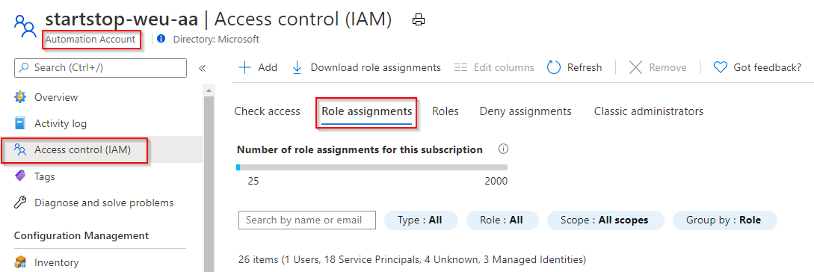

Adding Automation (Job/Runbook) Operator

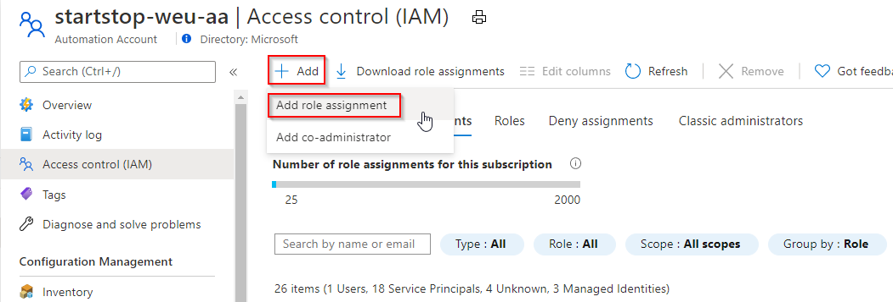

Add Names or Emails and in the popped open role assignment tab

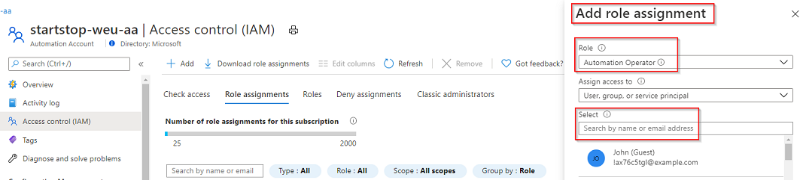

## Limiting access to individual runbooks/jobs

The above section provides access to the entire Azure Automation
account.  
If however, you want to provide access to individual runbooks or jobs,
this can NOT be accomplished using Azure Portal currently.

As a solution however you can utilize below PowerShell to grant access
to individual sub-resources inside the Automation Account. This is
shorted from the public documentation here.

$rgName = "\<Resource Group Name\>" \# Resource Group name for the
Automation Account  
$automationAccountName ="\<Automation account name\>" \# Name of the
Automation Account  
$rbName = "\<Name of Runbook\>" \# Name of the runbook  
$userId = Get-AzADUser -ObjectId "\<your email\>" \# Azure Active
Directory (AAD) user's ObjectId from the directory

\# Get the Automation account resource ID  
$aa = Get-AzResource -ResourceGroupName $rgName -ResourceType
"Microsoft.Automation/automationAccounts" -ResourceName
$automationAccountName

\# Get the Runbook resource ID  
$rb = Get-AzResource -ResourceGroupName $rgName -ResourceType
"Microsoft.Automation/automationAccounts/runbooks" -ResourceName
"$rbName"

\# The Automation Job Operator role only needs to be run once per user  
New-AzRoleAssignment -ObjectId $userId -RoleDefinitionName "Automation
Job Operator" -Scope $aa.ResourceId

\# Adds the user to the Automation Runbook Operator role to the Runbook
scope  
New-AzRoleAssignment -ObjectId $userId.Id -RoleDefinitionName
"Automation Runbook Operator" -Scope $rb.ResourceId

A user with just individual runbooks granted runbook operator role, will
see only these runbook(s) in the resource group and can start jobs as
otherwise documented earlier.  
Granting access to ONLY the runbooks and jobs shows under ‘all
resources’ in Azure Portal, it will NOT show up in Azure Automation
Accounts because access it granted ONLY to the runbooks and jobs within
themselves.

Below an example of exactly this – only runbooks granted access to a
user and the actual Azure Automation Account

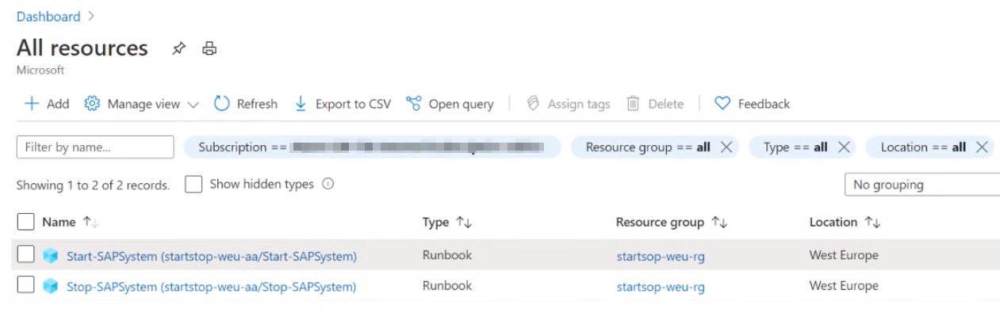
