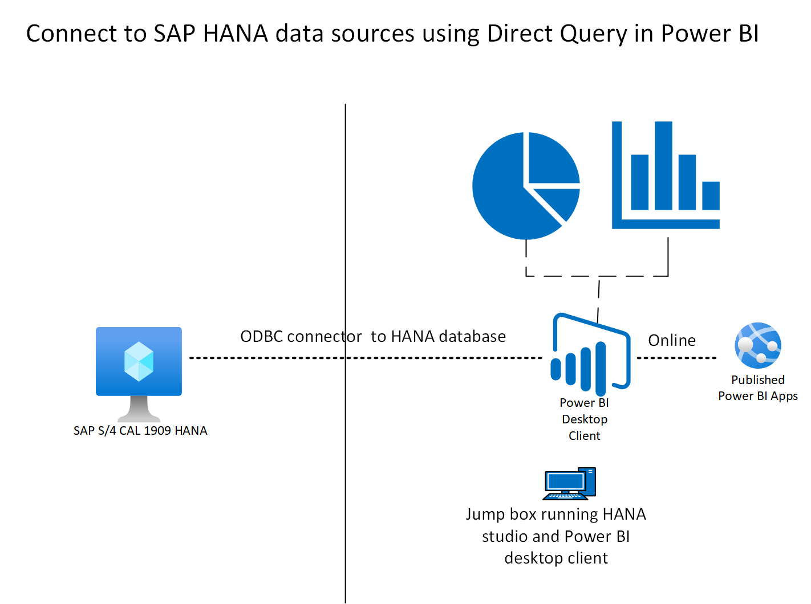

# Table of Contents 

* [Finalize the description for challenge](#Finalize-the-description-for-challenge)
* [Understand required Architecture, Azure components and Services](#Understand-required-Architecture-Azure-components-and-Services) 
* [Get equipped with necessary skills and Knowledge](#Get-equipped-with-necessary-skills-and-Knowledge)
* [Final Architecture](#Final-Architecture)

**Description:**

 

Generate self-service sales report from SAP system. Option 1: Extract sales data from SAP system to ADLS and generate analytics  report using power BI /Synapse. Option 2:  Generate self-service sales report using direct query to SAP  HANA system. 

 

# Finalize the description for challenge

 

   Generate self-service SAP system  report about batch jobs status and  name from SAP system. 

 

   * Download Power BI client and connect SAP HANA DB using Power BI configuration option. 

   * Extract  table TBTCO ( SAP job status ) using SQL and   Generate self-service Job status report  using direct custom query to SAP system. 

 

 

 

# Understand required Architecture, Azure components / Services

 

   * Download Power  BI  desktop from windows power app platfrom  

   * Execute the install and make sure that you have network connectivity from Jump box to SAP HANA DB and required HANA DB ports are open. ( no firewall issues etc..) 

   * For the HANA DB create the SCHEMA user with admin rights on SAP SCHEMA and assign appropriate roles and privileges to extract the data. 

   * Open the BI desktop client and execute the connection configure for SAP HANA database. 

   * Enter the Server IP address , select ports  (custom ) and port  for the  HANA system ID  ( for example SAP HANA system ID NN ports will be 3NN40-3NN99) 

   * Select Appropriate user name,  password and SSL encryption - none 

   * Select direct query for data connectivity Mode  

   * Extract the data and see the  tabular from of the DB 

 

 

 

# Get equipped with necessary skills / Knowledge 

 

   * Target Roles: DBA, BASIS and Technical Architect 

   * SAP HANA database administrator  

   * Report creation and selection for data analytics 

   * HANA DB skills – how to create Schema user and assign roles and privileges 

   * Other tools - perf. benchmark tools, snapshot validation tools, Portal, CLI, bash scripting, Linux Administration 

 

 

 

# Final Architecture 

 

 

   
5. **COMPLETE - Due Jan 30th - Build prototype and testing**

 

   * Building the prototype and respective testing: 

   * Base Infra to support the challenge - VMs, ANF volumes, scale-out HANA 

   * Download power BI desktop and configure 

   * Create HANA DB schema and user , assign appropriate roles and privileges  to user to extract the data 

   * Extract the data and start working filtering and value selection 

   * Generate the Chart  

   * Publish the Chart 

6. **IN PROGRESS BUT AT RISK OF DELAY - Document the challenge and the step by step process**

 

   * Document the Challenge - Participant Guide (by 2/12) 

   * Participant Documentation ( in progress)  

   * Document the Challenge -  ( in progress )  

7. **PLANNED -Test documented process**

 
8. **PLANNED -Internal dry run with in Team and identify any gaps**

9. **PLANNED -Update documentation based on leanings**
10. **PLANNED -Dry run with CSA community**

11. **PLANNED -If there are any lessons, update documentation**

12. **PLANNED -Ready to conduct OpenHack at the customer**

13. **Other**

   Take snapshot based Hana backup on region1 SAP system and do the system refresh on region 2 SAP system. 

 

 

Milestones #1, 2 and 3 are pretty much drafted – see below. Now I just need to formally document it so that I can mark the first three milestones complete. I am targeting to catch up by the end of this week. I will need certain infra. components and steps done prior to this challenge which I have mentioned. We will need to discuss to identify more for each of the challenges. The weekly call will be a great place to discuss integration points. 

  

Notes:Technologies and concepts to touch upon: 

Backup Policy (keys concepts such as volumes to protect, retention, frequency, immutability, costs, replication) 

Review and adjust or create volume sizes for backups (The ask would be to be able to adjust the volume size per backup policy, therefore, when the infra is put together, we should not provision backup volumes, which will be done as part of this exercise) 

Create other infra. for backup (replication, blob storage for immutability and cost reduction) 

Take ANF snapshots (and differentiate between Storage snapshots and HANA snapshots and why we need both for a quiescent database) 

Adjust RBAC and FW for azacsnap SPN (leave firewall restricted enough for the participant to fix this along with RBAC settings) 

Schedule backups using azacsnap (centrally managed) – this is a big piece – help the participant understand the config file how to adjust the retention using cron job and azacsnap functionality 

Test backup consistency 

Check ANF volume performance (throughput) using FIO (I can also include HCMT here or it could be part of the previous challenges) 

Offloading snapshots to blob storage for immutability using azcopy 

Set up CRR (I will need a secondary system in DR for the refresh which should be part of previous challenges #1,2 or 3) 

Pause CRR and use the replicated volumes for restore 

Restore: Perform a HANA DB restore and validate it from HANA DB level ( we won’t have time to do complete system refresh. The purpose is to show how we can get the data over 

Resume CRR 

 

Add Hints to accelerate the challenge execution -  

Expect them to know innerworkings of azacsnap (hdbsql commands) 

Lets not waste their time in things that are not required for the challenge (coding, scripting etc.) 

 
